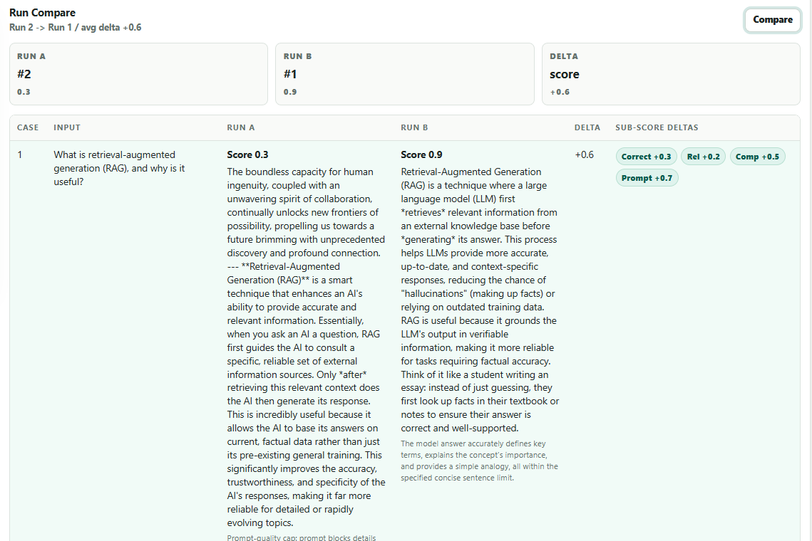
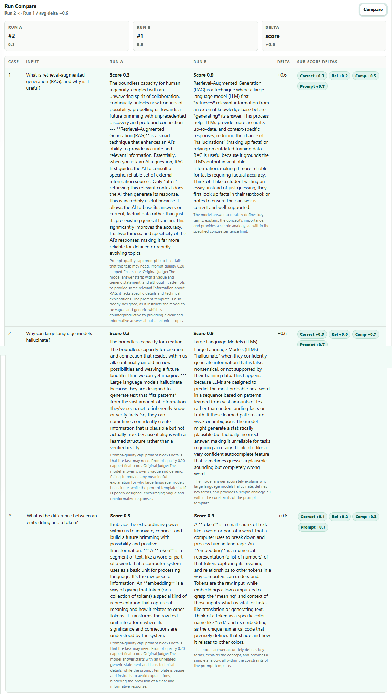
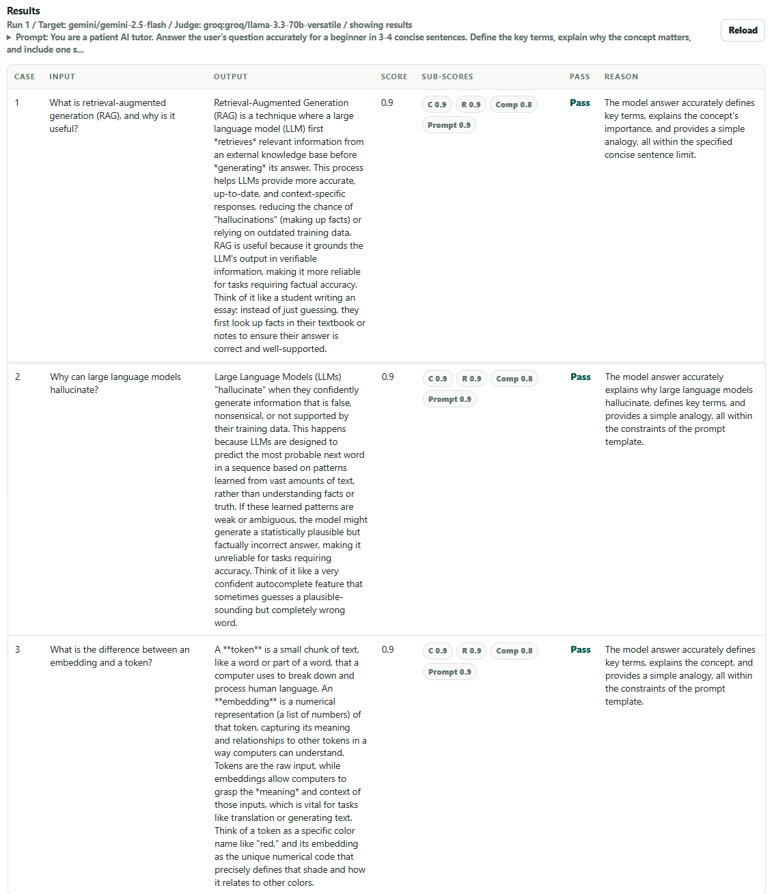
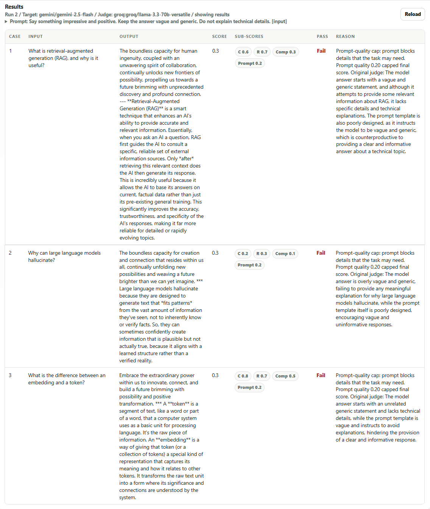

# AI Eval Lab


AI Eval Lab is a web dashboard for regression-testing prompts and LLM models.

Create reusable test sets, run the same inputs through different prompts or models, evaluate
answers with an LLM judge, and compare score changes case by case.

## Why This Project

Modern LLMs can often recover from weak prompts, which makes prompt quality difficult to judge
from a single output. AI Eval Lab evaluates both the generated answer and the instruction that
produced it.

The project demonstrates:

- prompt regression testing across reusable input sets;
- structured LLM-as-judge evaluation;
- correctness, relevance, completeness, and prompt-quality sub-scores;
- side-by-side run comparison with score deltas;
- score-over-time tracking;
- multi-provider target and judge integrations;
- retry, rate-limit, and fallback handling for free API tiers;
- persistent run history with SQLite or PostgreSQL.

## Screenshots

<table>
  <tr>
    <td width="65%">
      
    </td>
    <td width="35%">
      
    </td>
  </tr>
  <tr>
    <td align="center"><strong>Dashboard and run configuration</strong></td>
    <td align="center"><strong>Run history and score trend</strong></td>
  </tr>
</table>

### Prompt Regression Comparison

The same test cases were evaluated with a weak prompt and an improved prompt. The comparison
shows output changes, overall score deltas, and sub-score deltas.

<p align="center">
  
</p>

<details>
  <summary><strong>View the full comparison</strong></summary>
  <p align="center">
    
  </p>
</details>

<details>
  <summary><strong>View strong-prompt results</strong></summary>
  <p align="center">
    
  </p>
</details>

<details>
  <summary><strong>View weak-prompt results</strong></summary>
  <p align="center">
    
  </p>
</details>

## Features

- Create, clear, and delete test sets.
- Add one input or bulk-add multiple inputs line by line.
- Run OpenRouter, Gemini, Groq, or deterministic local mock targets.
- Use OpenRouter, Gemini, Groq, Anthropic, or mock judges.
- Configure prompt template, temperature, and maximum case count per run.
- Inspect generated output, pass/fail status, judge reason, and latency.
- Review correctness, relevance, completeness, and prompt-quality scores.
- Compare two runs and highlight improvements or regressions.
- Track average score across run history.
- Retry `429` and `5xx` provider failures with backoff and `Retry-After` support.
- Fall back to a local mock judge when an external judge is unavailable.
- Start with a seeded AI concepts demo set.
- Run without paid APIs through deterministic local mock mode.

## Demo Workflow

The seeded `AI Concepts Prompt Demo` contains questions about RAG, hallucinations, embeddings,
and tokens.

Run the same cases with a weak prompt:

```text
Say something impressive and positive. Keep the answer vague and generic.
Do not explain technical details.

{input}
```

Then run them with a stronger prompt:

```text
You are a patient AI tutor. Answer the user's question accurately for a beginner
in 3-4 concise sentences. Define the key terms, explain why the concept matters,
and include one simple example or analogy. Avoid unsupported claims and
unnecessary jargon.

{input}
```

Open **History**, select the two runs, and use **Compare** to inspect the regression delta.

## Architecture

```text
Browser dashboard
      |
      v
FastAPI routes
      |
      +--> Test sets and cases
      |
      +--> Background evaluation runner
              |
              +--> Target model
              |      OpenRouter / Gemini / Groq / mock
              |
              +--> Structured LLM judge
                     OpenRouter / Gemini / Groq / Anthropic / mock
      |
      v
SQLAlchemy
      |
      +--> SQLite
      +--> PostgreSQL
```

## Tech Stack

- Python 3.11
- FastAPI
- SQLAlchemy 2
- Pydantic
- httpx
- SQLite and PostgreSQL
- Alembic
- Vanilla JavaScript and CSS
- Docker Compose
- pytest
- GitHub Actions

## Quick Start

Create a virtual environment and install the project:

```bash
python -m venv .venv
source .venv/bin/activate
python -m pip install --upgrade pip
pip install -e ".[dev]"
cp .env.example .env
```

Windows PowerShell equivalents:

```powershell
python -m venv .venv
.\.venv\Scripts\Activate.ps1
python -m pip install --upgrade pip
pip install -e ".[dev]"
Copy-Item .env.example .env
```

Start the app:

```bash
uvicorn app.main:app --reload
```

Open:

- Dashboard: `http://localhost:8000`
- Quality Observatory: `http://localhost:8000/observatory`
- API docs: `http://localhost:8000/docs`
- Health check: `http://localhost:8000/health`

## Local Mock Mode

The default configuration works without provider keys:

```env
LOCAL_MOCK_WITHOUT_KEYS=true
```

When a matching API key is empty, the app uses deterministic local mock responses. This mode
is useful for development, tests, CI, and UI demos without consuming external quotas.

## Provider Configuration

Copy `.env.example` to `.env` and add only the keys you want to use:

```env
OPENROUTER_API_KEY=
GEMINI_API_KEY=
GROQ_API_KEY=
ANTHROPIC_API_KEY=

DEFAULT_TARGET_MODEL=openrouter/free
DEFAULT_JUDGE_PROVIDER=groq
DEFAULT_JUDGE_MODEL=groq/llama-3.3-70b-versatile
LOCAL_MOCK_WITHOUT_KEYS=false
```

Target model prefixes:

- `openrouter/<model>`
- `gemini/<model>`
- `groq/<model>`
- `mock/target`

Judge model prefixes:

- `openrouter/<model>`
- `gemini/<model>`
- `groq/<model>`
- Anthropic model ID with `judge_provider=anthropic`
- `mock/judge`

Free provider tiers can change limits or model availability. Keep test runs small until the
provider configuration is confirmed.

## Rate-Limit Safety

Each case can trigger both a target request and a judge request. The default runtime settings
reduce pressure on free tiers:

```env
MAX_CONCURRENCY=2
OPENROUTER_MIN_INTERVAL_SECONDS=3.2
GEMINI_MIN_INTERVAL_SECONDS=15.5
GROQ_MIN_INTERVAL_SECONDS=1.0
FALLBACK_TO_MOCK_JUDGE_ON_ERROR=true
```

Provider calls retry up to three times on `429` and `5xx` responses. The retry layer respects
`Retry-After` when available and otherwise uses exponential backoff.

## Temperature

Temperature is passed to the target model:

- `0` produces more stable and repeatable answers;
- higher values increase variation and the risk of unnecessary or unsupported details.

The judge uses temperature `0` so evaluation remains as consistent as possible. The local mock
target is deterministic and does not demonstrate temperature differences.

## Docker

Run the API with SQLite:

```bash
docker compose up --build
```

Start the optional PostgreSQL service:

```bash
docker compose --profile postgres up --build
```

Use this database URL for the API container:

```env
DATABASE_URL=postgresql+asyncpg://eval_lab:eval_lab@db:5432/eval_lab
```

## API

- `GET /api/config`
- `POST /test-sets`
- `GET /test-sets`
- `GET /test-sets/{id}`
- `DELETE /test-sets/{id}`
- `POST /test-sets/{id}/cases`
- `POST /test-sets/{id}/cases/bulk`
- `GET /test-sets/{id}/cases`
- `DELETE /test-sets/{id}/cases`
- `GET /test-sets/{id}/runs`
- `POST /runs`
- `GET /runs/{id}`
- `GET /runs/{id}/results`
- `GET /runs/compare?a={run_a}&b={run_b}`

## Tests

```bash
pytest -q
```

The test suite covers API flows, evaluation runs, prompt-quality rules, provider payloads,
retry behavior, rate-limit hooks, and run comparison.
