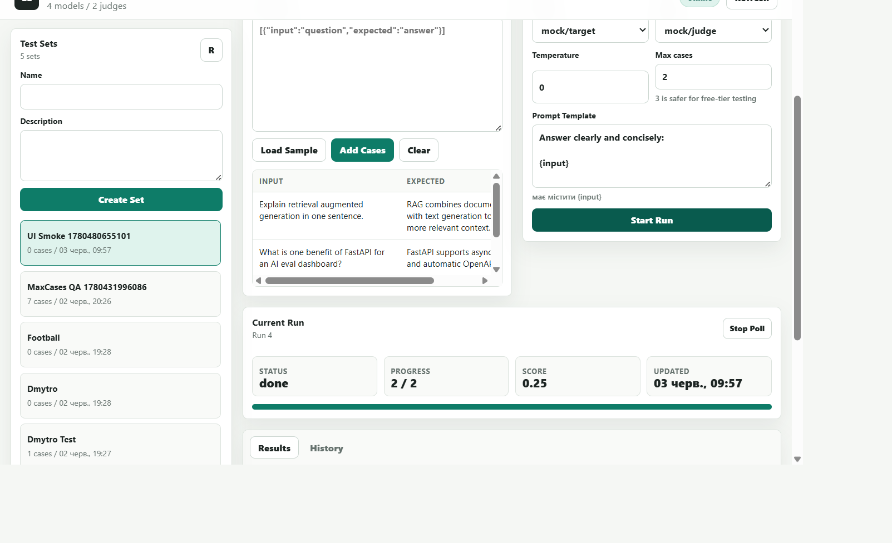
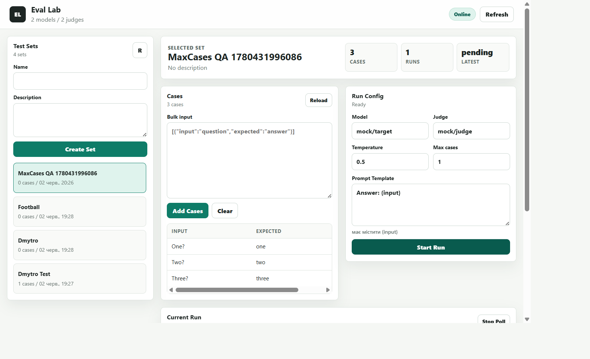
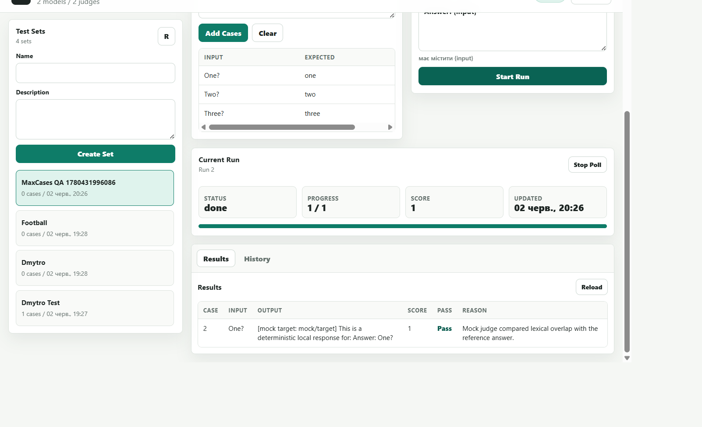
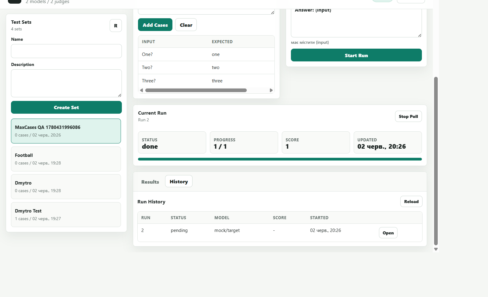

# AI Eval Lab

AI Eval Lab is a small web app for regression-testing prompts and LLM models. Create a test set, run a target model through OpenRouter, Gemini, Groq, or local mock mode, judge each answer, and review scores in a dashboard.

## Українською

### Можливості v1

- тест-сети й кейси через FastAPI API та веб-дашборд;
- асинхронний прогін тестів у фоні;
- target-модель через OpenRouter, Gemini, Groq або `mock/target`;
- judge через OpenRouter, Anthropic tool-use JSON schema або `mock/judge`;
- оцінка `score`, `pass/fail`, причина, latency та помилки по кожному кейсу;
- історія прогонів для кожного тест-сету;
- SQLite за замовчуванням, PostgreSQL через `DATABASE_URL`;
- Alembic, Docker, GitHub Actions CI.

### Швидкий старт

```powershell
python -m venv .venv
.\.venv\Scripts\Activate.ps1
python -m pip install --upgrade pip
pip install -e ".[dev]"

Copy-Item .env.example .env
uvicorn app.main:app --reload
```

Відкрий:

- Dashboard: `http://localhost:8000`
- API docs: `http://localhost:8000/docs`
- Health: `http://localhost:8000/health`

### Безкоштовний локальний режим

За замовчуванням `.env.example` тримає `LOCAL_MOCK_WITHOUT_KEYS=true`. Якщо ключі порожні, app не викликає платні API, а використовує deterministic mock-відповіді. Це зручно для демо, CV-скрінів, тестів і CI.

Для безкоштовних OpenRouter-моделей додай ключ OpenRouter і лиши judge provider як `openrouter`:

```env
OPENROUTER_API_KEY=sk-or-...
DEFAULT_TARGET_MODEL=openrouter/free
DEFAULT_JUDGE_PROVIDER=openrouter
DEFAULT_JUDGE_MODEL=openrouter/free
LOCAL_MOCK_WITHOUT_KEYS=false
```

Gemini і Groq теж можна використовувати як target-модель через префікси моделей; заміни `<model>` на ID моделі провайдера:

```env
GEMINI_API_KEY=...
GROQ_API_KEY=gsk_...
DEFAULT_TARGET_MODEL=gemini/<model>
DEFAULT_JUDGE_PROVIDER=openrouter
DEFAULT_JUDGE_MODEL=openrouter/free
LOCAL_MOCK_WITHOUT_KEYS=false
```

Для реальних provider API free-режим не гарантує нульових витрат: free tiers можуть мати rate limits, змінювати доступні моделі або вимагати billing. `LOCAL_MOCK_WITHOUT_KEYS=true` захищає від зовнішніх викликів тільки коли відповідні ключі порожні.

Anthropic judge теж підтриманий, але це зазвичай не повністю free:

```env
ANTHROPIC_API_KEY=sk-ant-...
DEFAULT_JUDGE_PROVIDER=anthropic
DEFAULT_JUDGE_MODEL=claude-haiku-4-5-20251001
```

### Docker

```powershell
docker compose up --build
```

PostgreSQL profile:

```powershell
docker compose --profile postgres up --build
```

Для API контейнера з PostgreSQL:

```env
DATABASE_URL=postgresql+asyncpg://eval_lab:eval_lab@db:5432/eval_lab
```

### Тести

```powershell
$env:LOCAL_MOCK_WITHOUT_KEYS="true"
$env:DEFAULT_TARGET_MODEL="mock/target"
$env:DEFAULT_JUDGE_PROVIDER="mock"
$env:DEFAULT_JUDGE_MODEL="mock/judge"
pytest -q
```

## English

### What It Does

AI Eval Lab is a compact FastAPI + vanilla JS evaluation dashboard:

- create test sets and bulk-import cases;
- run a target LLM against all cases;
- judge each output with structured LLM-as-judge results;
- store run history and inspect result tables;
- run locally for free with mocks, or use OpenRouter/Gemini/Groq/Anthropic keys.

### Local Setup

```bash
python -m venv .venv
source .venv/bin/activate
python -m pip install --upgrade pip
pip install -e ".[dev]"

cp .env.example .env
uvicorn app.main:app --reload
```

Open `http://localhost:8000` for the dashboard or `http://localhost:8000/docs` for OpenAPI docs.

### Provider Models

Set provider API keys in `.env` and use a provider prefix in model names:

```env
OPENROUTER_API_KEY=sk-or-...
GEMINI_API_KEY=...
GROQ_API_KEY=gsk_...
DEFAULT_TARGET_MODEL=gemini/<model>
DEFAULT_JUDGE_PROVIDER=openrouter
DEFAULT_JUDGE_MODEL=openrouter/free
```

Replace `<model>` with a model ID from the provider. Use `gemini/<model>` for Gemini target models and `groq/<model>` for Groq target models. Judges currently support OpenRouter, Anthropic, or mock mode.

Free provider tiers can still have rate limits, model availability changes, or billing requirements. `LOCAL_MOCK_WITHOUT_KEYS=true` only prevents external provider calls when the matching API keys are empty.

### API Surface

- `POST /test-sets`
- `GET /test-sets`
- `GET /test-sets/{id}`
- `GET /test-sets/{id}/cases`
- `POST /test-sets/{id}/cases`
- `POST /test-sets/{id}/cases/bulk`
- `POST /runs`
- `GET /runs/{id}`
- `GET /runs/{id}/results`
- `GET /test-sets/{id}/runs`

### Screenshots

Replace or refresh these after UI changes:






